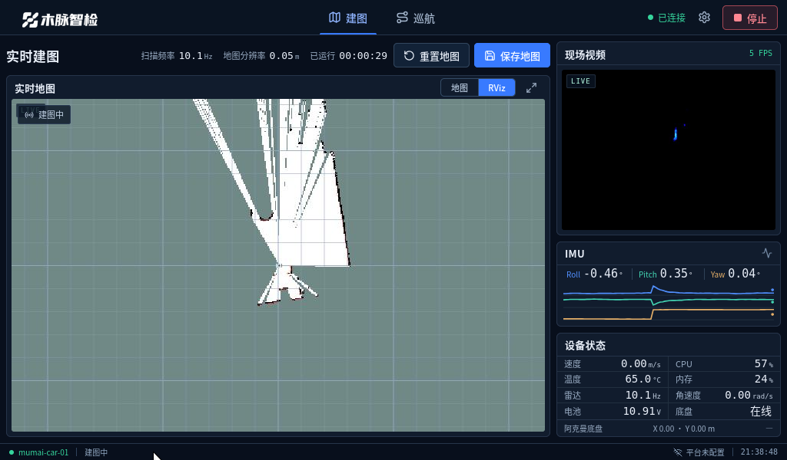
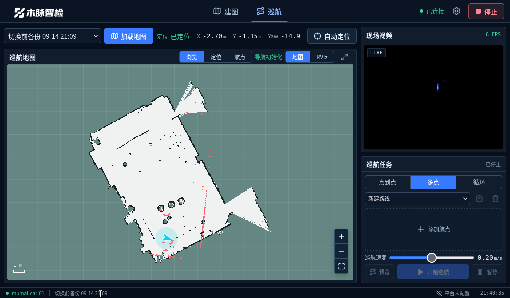

# 木脉智检 · 小车控制台

WHEELTEC 阿克曼底盘的**车载控制台**：React + Vite 前端、Python aiohttp + ROS 2 Humble 后端，
跑在小车自己的 Jetson 上，用 **1024×600** 触摸屏单屏操作，局域网只读监看。平台侧源码不做任何修改。

| 建图 | 巡航 |
| --- | --- |
|  |  |

## 功能

- **建图**：gmapping 启停、地图保存、重新建图自动备份、RViz 实时画面、可交互栅格视图。
- **巡航**：地图加载、AMCL 自动/人工定位、点到点 / 多点 / 循环、路线保存、Nav2 路径预览、暂停 / 继续 / 停止、速度设置（上限 0.35 m/s）。
- **定位吸附**：人工点选后自动移出障碍并做小范围（±0.35 m / ±12°）雷达-地图匹配微调，判据不足则保持点选位置；地图右下角另有 2 cm / 1.5° 六键微调盘。
- **遥测**：速度、IMU 姿态曲线、雷达频率、摄像头、CPU、温度、内存、电池电压 / 电量、底盘在线状态。
- **视频**：摄像头与 RViz 双路 MJPEG 内嵌播放，可另配双路 RTMP 外推。
- **上报**：平台注册与 HTTP 遥测，未配置目标时不外发。
- **安全**：写操作需本机控制令牌，跨源请求拒绝；开机不下发运动目标、不自动建图。

## 界面

两页（建图 / 巡航）深色工作台，按小车实屏 **1024×600** 设计，单屏不滚动：

```
顶栏 46 · 页脚 22 · 工作区留白 8 · 列间距 8
├─ 左栏 708 ： 页工具条 36 + 地图面板 708×472（地图可视区 694×434）
└─ 右栏 292 ： 现场视频 278×208.5（4:3） / IMU 三条曲线 / 设备状态 或 巡航任务
```

- 实时地图与摄像头**一律保持源比例**（`object-fit: contain`，容器比例与源一致），只有等比缩放，永不拉伸。
- 地图面板右上角可切换 `地图 / RViz`，并可一键**全屏地图**（隐藏右栏，地图可视区 994×434）。
- 支持 `?tab=cruise&view=map`、`?tab=mapping&view=rviz` 直达。
- 更宽窗口（≥1280px）自动放宽间距字号，≤820px 退化为单列滚动。

## 硬件与环境

| 项 | 说明 |
| --- | --- |
| 底盘 | WHEELTEC 阿克曼（`turn_on_wheeltec_robot`、`wheeltec_nav2`） |
| 雷达 / IMU | 随底盘 ROS 驱动（`/scan`、`/imu/data_raw`） |
| 摄像头 | Astra RGB（`/camera/color/image_raw`，640×480） |
| 系统 | Ubuntu 22.04 + ROS 2 Humble + XFCE，aarch64 |
| 屏幕 | HDMI-1 **1024×600**（`xrandr` 实测），Firefox kiosk 全屏 |
| 依赖 | `python3-aiohttp python3-numpy python3-pil python3-psutil python3-yaml xvfb ffmpeg xdotool` |

## 目录结构

```
backend/     aiohttp 服务：app.py 路由与状态机、ros_bridge.py ROS 适配、media.py 视频管线、
             processes.py 进程管理、core.py 地图与校验、uplink.py 平台上报、simulator.py 演示后端
src/         React 前端：App.tsx 页面与交互、MapCanvas.tsx 交互地图、useRobot.ts WS 状态、styles.css
deploy/      systemd 服务、kiosk 启动、RViz 配置 console.rviz、窗口布局脚本 rviz-layout.sh
docs/        接口说明、设计规格、验收记录
tests/       单元测试（几何/接口/鉴权/停止语义/遥测合法性）
```

## 本机演示（不连 ROS）

```bash
npm ci && npm run build
python3 -m venv .venv
.venv/bin/pip install -r backend/requirements.txt
.venv/bin/python backend/app.py --simulate --port 8766 --config runtime/simulator-config.json
# 打开 http://127.0.0.1:8766 ，页面会显示“演示”标记
```

前端热更新：`CONSOLE_BACKEND=http://127.0.0.1:8766 npm run dev`。

## 部署到小车

先 `npm ci && npm run build`，把项目（排除 `node_modules`、`.venv`、`dist` 之外的本机 `runtime` 与 `config.local.json`）复制到 `/home/wheeltec/mumai-console`，
保留小车已有 `runtime`（地图与路线在里面），然后在小车上：

```bash
sudo cp -r <build>/dist /home/wheeltec/mumai-console/dist
bash deploy/install.sh          # 安装 systemd 服务与桌面自启
sudo systemctl restart mumai-console
```

生产模式使用系统 `rclpy`/`cv_bridge`，不通过 pip 安装 ROS；`deploy/run.sh` 会加载小车现有 ROS 工作空间。

```bash
sudo systemctl status mumai-console
journalctl -u mumai-console -f
```

停用自启：`sudo systemctl disable --now mumai-console` 并移走 `~/.config/autostart/mumai-console.desktop`。

## 实时地图推流原理

RViz 跑在**独立 Xvfb 显示**（`rviz_display`，默认 `:99`），屏幕尺寸就是推流尺寸（`rviz_size`，默认 694×434，与页面上地图面板的可用区域一致）：

1. `rviz-layout.sh` 由后端带着渲染尺寸与 Qt 边框宽度（`rviz_chrome`）启动，把 RViz 窗口左上角推到屏幕外，
   于是 Xvfb 可见区域**只剩 3D 渲染区**——菜单栏、工具栏、状态栏都不会进入画面，也不会出现等待边框。
2. Xvfb 以 `-nocursor` 启动，鼠标指针不会被烙进推流。
3. `deploy/console.rviz` 是唯一权威配置，每次启动复制成 `runtime/rviz/console.rviz` 再交给 RViz，避免 RViz 退出回写污染。
4. 后台按 `video_fps` 抓屏编码 JPEG，前端用 `contain` 等比显示，地图面板比例与推流比例一致，因此既不变形也没有黑边。
5. 固定坐标系用 `map`（地图自身帧）：`/map` 的显示因此不依赖坐标变换，否则 RViz 的 tf 过滤器会以
   “消息时间早于 TF 缓存”为由把只发一次的锁存地图丢掉。Map 显示的持久性用 Transient Local，RViz 后启动也能收到。
6. 待命时底盘不发布任何 `map→*` 变换，`ros_bridge` 会补发恒等 `map→odom_combined`（建图/巡航由 gmapping/AMCL 接管），
   待命与巡航都有网格可看；视角目标帧 `console_view` 由 `ros_bridge` 依据里程计发布（只平移、不旋转），小车始终居中且地图朝上。

## 接口

浏览器侧：`/api/state`、`/api/ws`（WebSocket 状态流）、`/api/streams/{rviz,camera}.mjpeg`、
`/api/maps`、`/api/map.png`、`/api/routes`、`/api/{group}/{action}`（写操作需 `X-Control-Token`）。
完整协议与字段见 [docs/接口说明.md](docs/接口说明.md)。

## 测试与验收

```bash
.venv/bin/python -m unittest discover -s tests -v      # 本机：10 通过 / 5 跳过（需 ROS 库）
python3 -m unittest discover -s tests                  # 小车（source ROS 后）：15 项全部通过
```

设计规格见 [docs/design-spec.md](docs/design-spec.md)，真实屏幕验收证据（1024×600 无溢出、推流 694×434 无边框、
IMU 三曲线、巡航按钮全部可见、实机建图/巡航状态）见 [docs/验收记录.md](docs/验收记录.md)。

## 已知边界

- 真实场地的动态导航精度、避障与循环巡航需现场验收；仓库内不含任何运动目标的自动下发。
- `config.local.json` 含设备编号与控制令牌，**不要提交**（已在 `.gitignore` 中）。
- 地图、路线、日志属于运行时数据，位于小车 `runtime/`，不入库。
